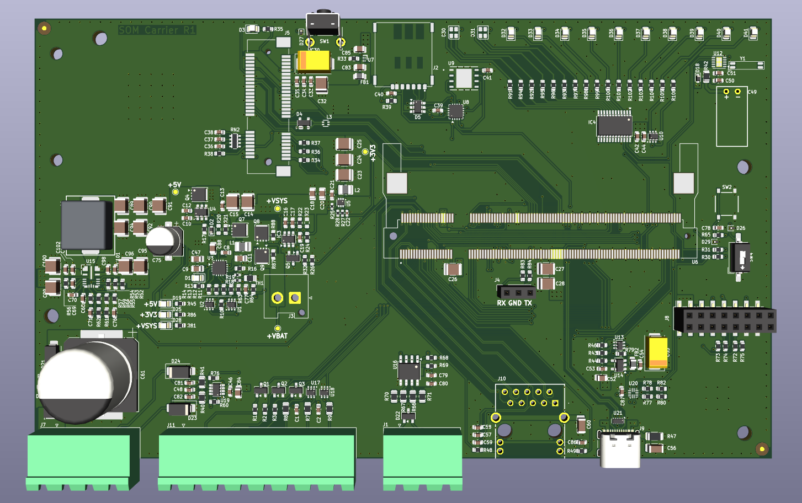
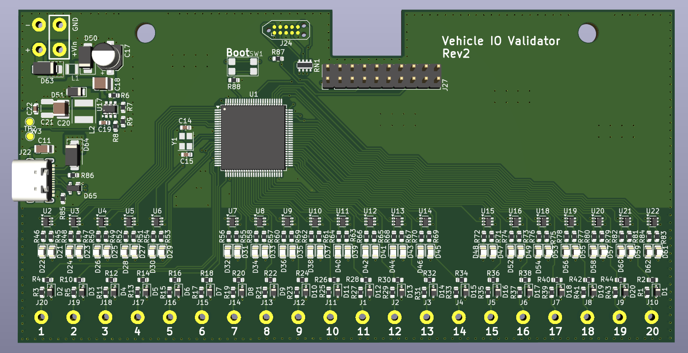
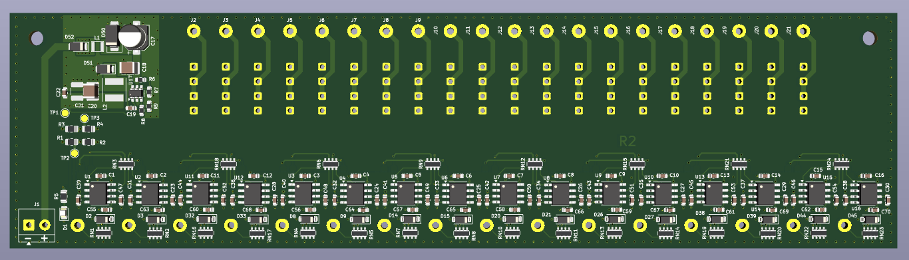
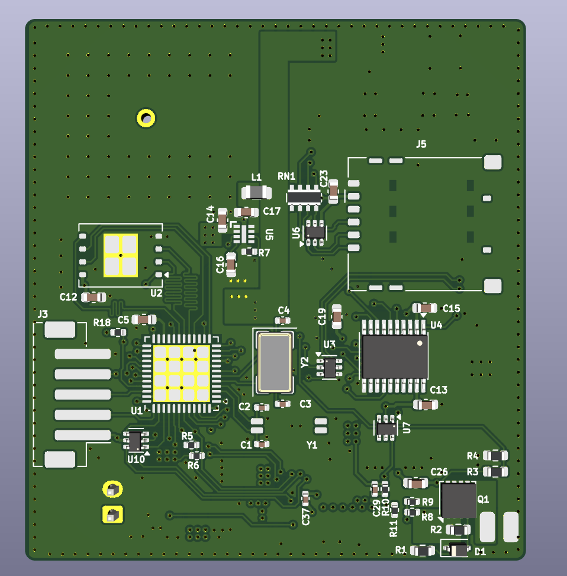
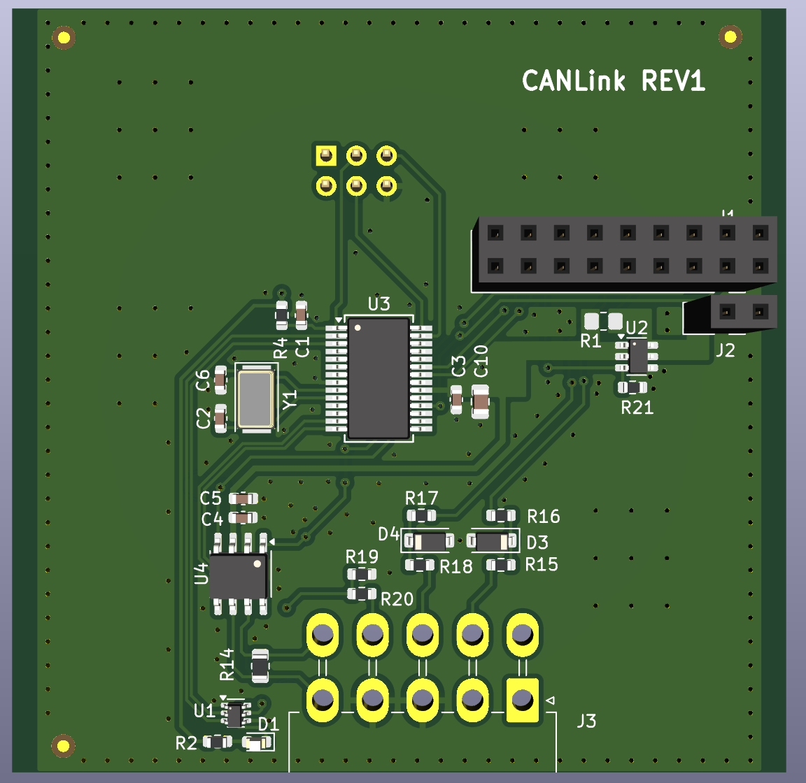

# Hardware Portfolio

PCB and embedded hardware projects by **Athanasios Vasiloglou**, Embedded Systems & Hardware Engineer.

Each folder is one project, with 3D renders, schematics, layer views and a write-up of the design.

---

## [BLE Channel Sounding Sensor Board](ble-channel-sounding-board/)

Custom nRF54L15 board for sub-metre indoor positioning with Bluetooth Channel Sounding. NTUA diploma thesis.

- **17 cm** mean ranging error across three anchors
- 4-layer, 38 × 25 mm PCB in KiCad
- Accelerometer + magnetometer, temperature / humidity / pressure
- USB-C or Li-ion, with charger and buck-boost

`nRF54L15` `Zephyr` `KiCad` `BLE` `Channel Sounding`

 

---

## [Handheld High-Irradiance LED Controller](handheld-irradiance-system/)

Battery-powered controller for a high-power red LED array. Freelance design across three boards.

- USB-C PD input, 2S Li-ion charger with power-path
- 4-switch buck-boost LED rail, 7 constant-current channels
- nRF52840 Bluetooth LE, IR temperature sensing, fan control

`Altium` `USB-C PD` `Power electronics` `nRF52840` `LED drivers`

 

---

## [GPS/GSM Tracker](gps-gsm-tracker/)

LTE Cat-1 + GNSS vehicle tracker, Rev 3 redesigned in KiCad for production.

- STM32U575 low-power MCU, SIMCom A7672 LTE modem, u-blox NEO-M9N GNSS
- Li-ion charger with power-path, wide-input buck, backup cell
- 4-layer, 65 × 94 mm, 192 components

`STM32U5` `LTE Cat-1` `GNSS` `KiCad` `4-layer`

 

---

## [Linux SoM Carrier Board](linux-som-carrier-board/)

Industrial IoT carrier for an NXP i.MX 91 Linux SoM. Full design and bring-up.

- Quectel EC25 LTE (mini-PCIe), dual SIM
- Ethernet, RS-485, CAN, USB-C, digital I/O, RTC, tamper input
- Wide-input supply, Li-ion backup with power-path
- 4-layer, 167 × 100 mm, 274 components

`i.MX 91` `Embedded Linux` `LTE` `KiCad` `Industrial IoT`

 

---

## [Vehicle I/O Validator](vehicle-io-validator/)

Test tool that monitors 20 vehicle I/O lines and reports them to a PC over USB.

- 20 protected inputs with red / blue status LEDs per channel
- STM32U545, USB-C, 60 V buck from the vehicle supply
- 4-layer, 142 × 72 mm, 232 components

`STM32U5` `Automotive` `Test equipment` `KiCad`

 

---

## [Control Unit Tester](control-unit-tester/)

Stand-alone, fully analog bench tester for vehicle control units.

- 16 inputs with window-comparator status LEDs
- 20 outputs, each switchable to +Vin / open / GND
- 60 V buck from the vehicle supply, no MCU needed
- 4-layer, 194 × 52 mm, 236 components

`Analog` `Automotive` `Test equipment` `KiCad`

 

---

## [Compact LTE-M / NB-IoT Tracker](compact-lte-tracker/)

Small battery-backed asset tracker.

- Quectel BG96 (LTE-M / NB-IoT + GNSS), STM32U545
- Accelerometer wake-up, NOR flash logging
- Li-ion charger, wide-input buck, switched modem rail
- 4-layer, 49 × 53 mm, 89 components

`STM32U5` `LTE-M` `NB-IoT` `GNSS` `KiCad`

 

---

## [CANLink Module](can-link-module/)

Plug-in CAN bus interface that bridges a vehicle CAN bus to a host board over UART.

- PIC18LF26K83 with on-chip CAN controller, TI TCAN3413 transceiver
- Mini-Fit Jr vehicle connector, stacking sockets to the host board
- 2-layer, 65 × 64 mm, 40 components

`CAN` `PIC18` `Automotive` `KiCad`

 

---

[LinkedIn](https://www.linkedin.com/in/athanasios-vasiloglou-424599182/) · [GitHub profile](https://github.com/thanvas81)
