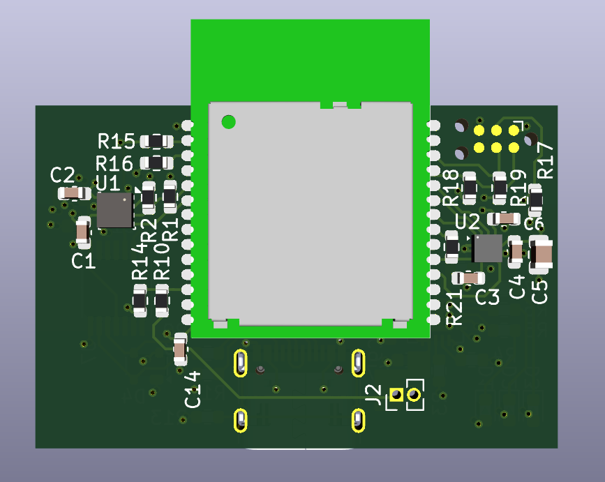
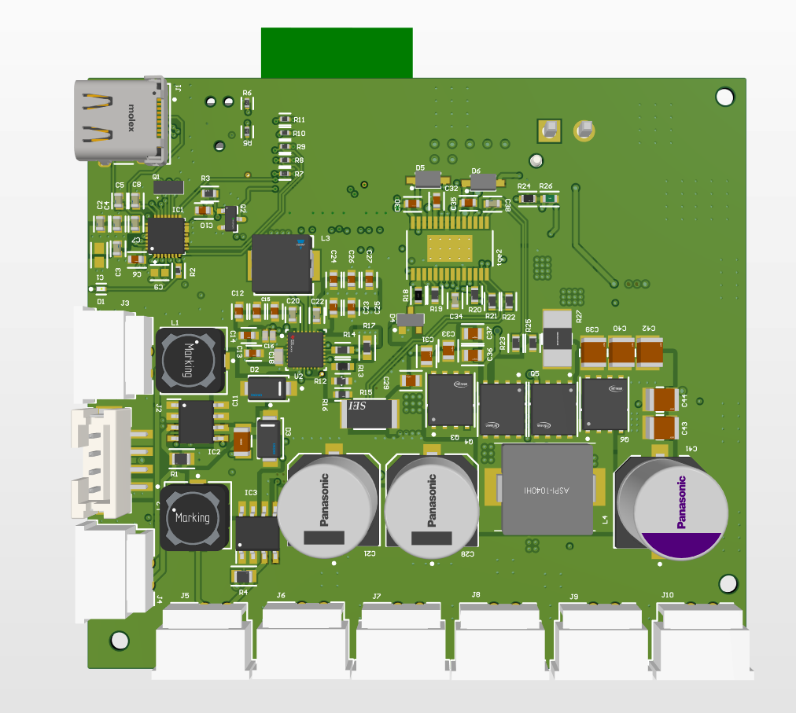

# Hardware Portfolio

PCB and embedded hardware projects by **Athanasios Vasiloglou**, Embedded Systems & Hardware Engineer.

Each folder is one project, with 3D renders, schematics, layer views and a write-up of the design.

---

## [BLE Channel Sounding Sensor Board](ble-channel-sounding-board/)

Custom nRF54L15 board for sub-metre indoor positioning with Bluetooth Channel Sounding. NTUA diploma thesis.

- **17 cm** mean ranging error across three anchors
- 4-layer, 38 × 25 mm PCB in KiCad
- Accelerometer + magnetometer, temperature / humidity / pressure
- USB-C or Li-ion, with charger and buck-boost

`nRF54L15` `Zephyr` `KiCad` `BLE` `Channel Sounding`

 

---

## [Handheld High-Irradiance LED Controller](handheld-irradiance-system/)

Battery-powered controller for a high-power red LED array. Freelance design across three boards.

- USB-C PD input, 2S Li-ion charger with power-path
- 4-switch buck-boost LED rail, 7 constant-current channels
- nRF52840 Bluetooth LE, IR temperature sensing, fan control

`Altium` `USB-C PD` `Power electronics` `nRF52840` `LED drivers`

 

---

[LinkedIn](https://www.linkedin.com/in/athanasios-vasiloglou-424599182/) · [GitHub profile](https://github.com/thanvas81)
