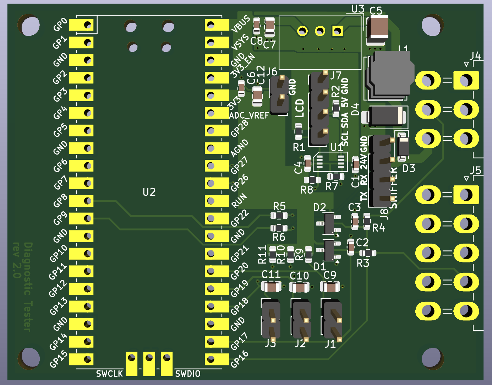

# Hardware Portfolio

PCB and embedded hardware projects by **Athanasios Vasiloglou**, Embedded Systems & Hardware Engineer.

Each project has 3D renders, schematics, layer views where available, and a write-up of the design. Projects are listed from most to least complex.

## At a glance

| # | Project | Area | Board | Key parts |
|---|---|---|---|---|
| 1 | [Industrial Controller / Gateway](industrial-controller-gateway/) | Industrial control | 4-layer · 340 × 147 mm · 486 parts | STM32H743, KSZ8863 Ethernet switch, isolated RS-485, mains AC/DC |
| 2 | [Linux SoM Carrier Board](linux-som-carrier-board/) | Industrial IoT | 4-layer · 167 × 100 mm · 274 parts | i.MX 91 SoM, EC25 LTE, Ethernet, RS-485, CAN |
| 3 | [Handheld High-Irradiance LED Controller](handheld-irradiance-system/) | Power electronics | 3 boards · Altium | USB-C PD, 2S charger, 4-switch buck-boost, nRF52840 |
| 4 | [GPS/GSM Tracker (Rev 3)](gps-gsm-tracker/) | IoT & tracking | 4-layer · 65 × 94 mm · 192 parts | STM32U575, LTE Cat-1, NEO-M9N GNSS |
| 5 | [BLE Channel Sounding Sensor Board](ble-channel-sounding-board/) | Wireless / thesis | 4-layer · 38 × 25 mm | nRF54L15, Channel Sounding, 17 cm mean error |
| 6 | [Vehicle I/O Validator (Rev 2)](vehicle-io-validator/) | Automotive test | 4-layer · 142 × 72 mm · 232 parts | STM32U545, 20 protected inputs, USB-C |
| 7 | [Compact LTE-M / NB-IoT Tracker](compact-lte-tracker/) | IoT & tracking | 4-layer · 49 × 53 mm · 89 parts | BG96, STM32U545, Li-ion charger |
| 8 | [Control Unit Tester (Rev 2)](control-unit-tester/) | Automotive test | 4-layer · 194 × 52 mm · 236 parts | Window comparators, 20 switched outputs |
| 9 | [RP2040 Diagnostic Tester (Rev 2)](rp2040-diagnostic-tester/) | Test tools | 2-layer · 69 × 54 mm | Raspberry Pi Pico, UART sniffer, 24 V input |
| 10 | [CANLink Module](can-link-module/) | Expansion module | 2-layer · 65 × 64 mm | PIC18 CAN controller, TCAN3413 |
| 11 | [Relay & Analog Input Expansion Board](relay-analog-io-board/) | Expansion module | 2-layer · 65 × 38 mm | TX2 relay, LMV324 analog front end |

---

## Featured projects

### [Industrial Controller / Gateway](industrial-controller-gateway/)

Mains-powered controller bridging a managed Ethernet switch to 24 V field I/O.

- STM32H743, KSZ8863 2-port Ethernet switch
- 2× isolated RS-485, 4–20 mA, PT100, opto inputs, relays, smart high-side outputs
- On-board 90 W AC/DC, four isolation domains, mains relay channel
- 4-layer, 340 × 147 mm, 486 components

`STM32H7` `Ethernet` `Isolation` `Mains` `KiCad`

 

---

### [Linux SoM Carrier Board](linux-som-carrier-board/)

Industrial IoT carrier for an NXP i.MX 91 Linux SoM. Full design and bring-up.

- Quectel EC25 LTE (mini-PCIe), dual SIM
- Ethernet, RS-485, CAN, USB-C, digital I/O, RTC, tamper input
- Wide-input supply, Li-ion backup with power-path
- 4-layer, 167 × 100 mm, 274 components

`i.MX 91` `Embedded Linux` `LTE` `KiCad` `Industrial IoT`

 

---

### [Handheld High-Irradiance LED Controller](handheld-irradiance-system/)

Battery-powered controller for a high-power red LED array. Freelance design across three boards.

- USB-C PD input, 2S Li-ion charger with power-path
- 4-switch buck-boost LED rail, 7 constant-current channels
- nRF52840 Bluetooth LE, IR temperature sensing, fan control

`Altium` `USB-C PD` `Power electronics` `nRF52840` `LED drivers`

 

---

### [GPS/GSM Tracker](gps-gsm-tracker/)

LTE Cat-1 + GNSS vehicle tracker, Rev 3 redesigned in KiCad for production.

- STM32U575 low-power MCU, SIMCom A7672 LTE modem, u-blox NEO-M9N GNSS
- Li-ion charger with power-path, wide-input buck, backup cell
- 4-layer, 65 × 94 mm, 192 components

`STM32U5` `LTE Cat-1` `GNSS` `KiCad` `4-layer`

 

---

### [BLE Channel Sounding Sensor Board](ble-channel-sounding-board/)

Custom nRF54L15 board for sub-metre indoor positioning with Bluetooth Channel Sounding. NTUA diploma thesis.

- **17 cm** mean ranging error across three anchors
- 4-layer, 38 × 25 mm PCB in KiCad
- Accelerometer + magnetometer, temperature / humidity / pressure
- USB-C or Li-ion, with charger and buck-boost

`nRF54L15` `Zephyr` `KiCad` `BLE` `Channel Sounding`

 

---

### [Vehicle I/O Validator](vehicle-io-validator/)

Test tool that monitors 20 vehicle I/O lines and reports them to a PC over USB.

- 20 protected inputs with red / blue status LEDs per channel
- STM32U545, USB-C, 60 V buck from the vehicle supply
- 4-layer, 142 × 72 mm, 232 components

`STM32U5` `Automotive` `Test equipment` `KiCad`

 

---

### [Compact LTE-M / NB-IoT Tracker](compact-lte-tracker/)

Small battery-backed asset tracker.

- Quectel BG96 (LTE-M / NB-IoT + GNSS), STM32U545
- Accelerometer wake-up, NOR flash logging
- Li-ion charger, wide-input buck, switched modem rail
- 4-layer, 49 × 53 mm, 89 components

`STM32U5` `LTE-M` `NB-IoT` `GNSS` `KiCad`

 

---

### [Control Unit Tester](control-unit-tester/)

Stand-alone, fully analog bench tester for vehicle control units.

- 16 inputs with window-comparator status LEDs
- 20 outputs, each switchable to +Vin / open / GND
- 60 V buck from the vehicle supply, no MCU needed
- 4-layer, 194 × 52 mm, 236 components

`Analog` `Automotive` `Test equipment` `KiCad`

 

---

## More boards

| | |
|:---:|:---:|
|  **[RP2040 Diagnostic Tester](rp2040-diagnostic-tester/)** Raspberry Pi Pico field tool that talks to and sniffs UART links on 24 V equipment, with LCD and buttons |  **[CANLink Module](can-link-module/)** Plug-in CAN ↔ UART bridge: PIC18 with on-chip CAN controller and TI TCAN3413 transceiver |
|  **[Relay & Analog Input Expansion Board](relay-analog-io-board/)** Stack-on board with a relay output and protected, buffered analog inputs | |

---

[LinkedIn](https://www.linkedin.com/in/athanasios-vasiloglou-424599182/) · [GitHub profile](https://github.com/thanvas81)

Designs are shown for portfolio purposes only. Projects built for employers and clients are presented without source files, and are not licensed for reuse.
