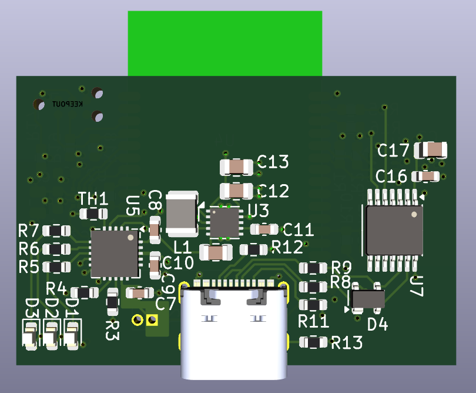
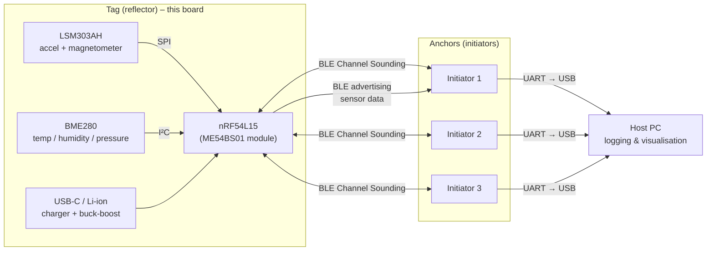
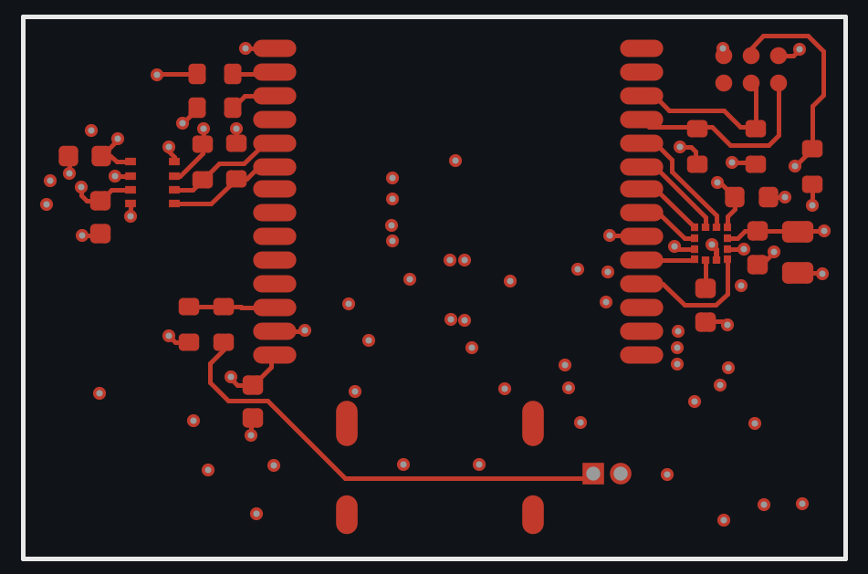
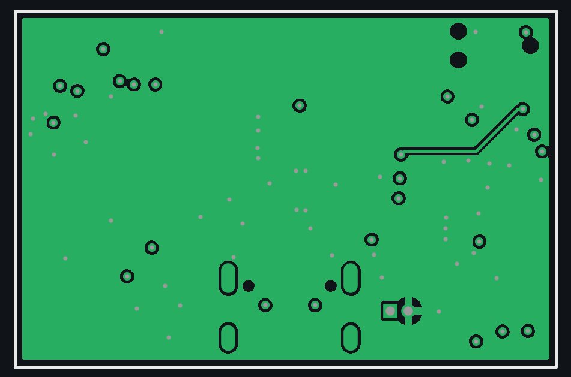
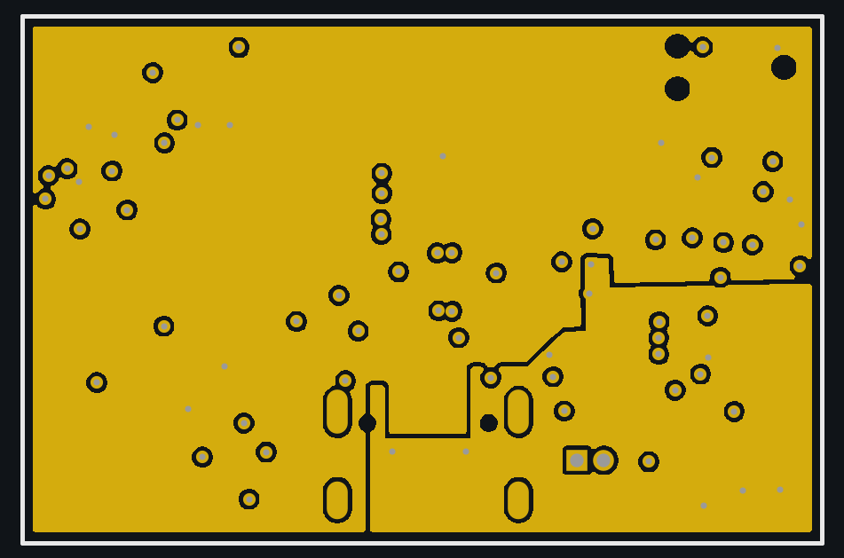
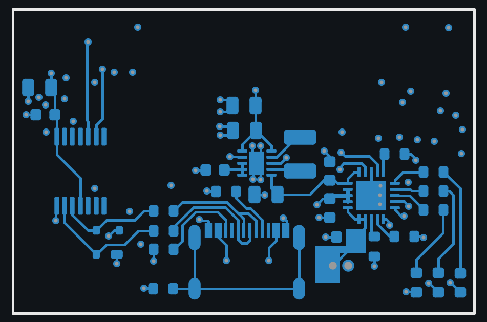
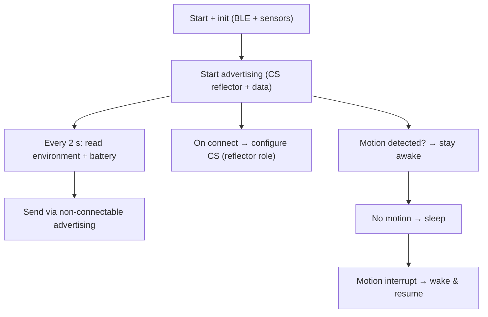
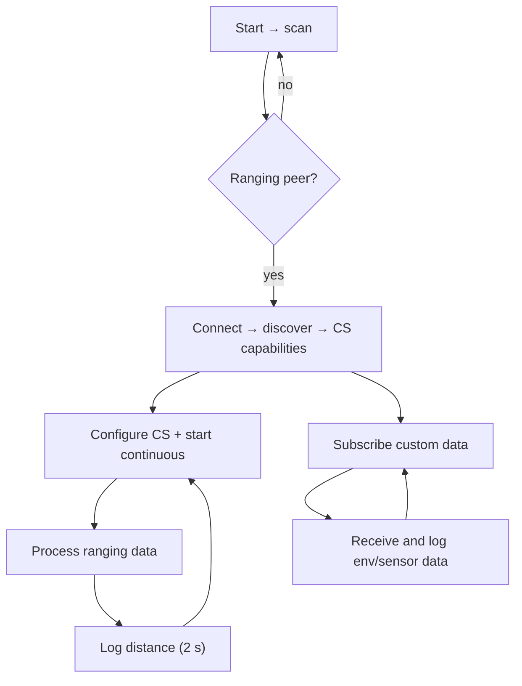
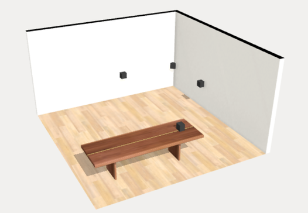
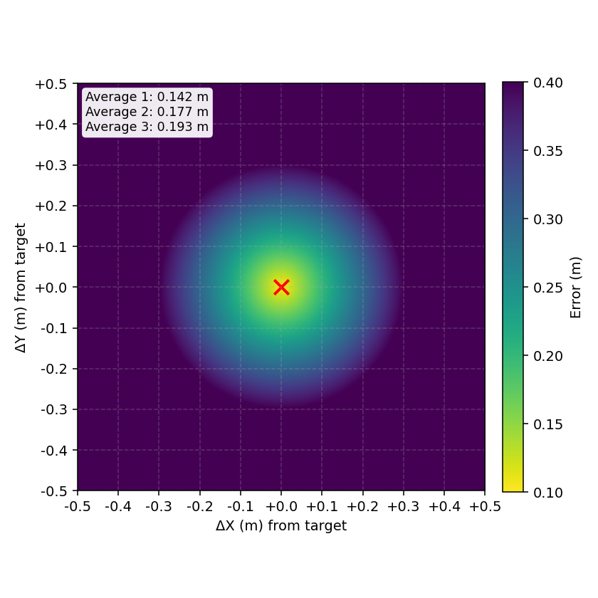

# BLE Channel Sounding Sensor Board

**Custom nRF54L15 board for sub-metre indoor positioning with Bluetooth Channel Sounding, plus environmental and motion sensing.**

Diploma thesis, School of Electrical and Computer Engineering, National Technical University of Athens (2025).
*Design of a Wireless Indoor Tracking System for Multi-Sensor Data Acquisition with BLE Channel Sounding*. Supervisor: Prof. E. Hristoforou.

<p align="center">
  
  &nbsp;
  
</p>

## Highlights

- **17 cm mean ranging error** across three anchors at 3–4.5 m, measured over a one-hour indoor capture
- **Bluetooth Channel Sounding** (Bluetooth 6.0) distance estimation using IFFT and phase-based ranging, instead of RSSI
- **4-layer, 38 × 25 mm PCB** designed in KiCad around the nRF54L15 SoC, with a continuous inner ground plane for RF performance
- **Multi-sensor**: 3-axis accelerometer + magnetometer (motion wake-up) and temperature / humidity / pressure
- **Portable power**: USB-C or single-cell Li-ion, with charger, power-path and buck-boost to a stable 3.3 V

## System overview



## Hardware

| Block | Part | Notes |
|---|---|---|
| SoC / radio | Minew **ME54BS01** (Nordic **nRF54L15**) | BLE 6.0 Channel Sounding, integrated antenna |
| Motion | ST **LSM303AH** | 3-axis accelerometer + magnetometer on SPI, interrupt lines for motion wake-up |
| Environment | Bosch **BME280** | Temperature, humidity, pressure on I²C |
| Charger | Microchip **MCP73871** | Li-ion charging with power-path management and NTC input |
| Regulation | TI **TPS63031** buck-boost, TI **TLV70018** LDO | 3.3 V from 3.0–4.2 V battery or 5 V USB |
| USB | USB-C receptacle, Nexperia **PRTR5V0U2X** ESD, Microchip **MCP2221A** | USB-to-UART bridge for logging |
| Debug | Tag-Connect **TC2030** | SWD programming without a header |

Schematic is split into hierarchical sheets: power supply, charger, buck-boost, LDO, USB-C, USB-to-serial, temperature sensor, accelerometer/magnetometer.

**Files**

### PCB layers

4-layer stackup, 1.6 mm FR4: signals on the outer layers, a continuous ground plane on inner 1 for RF stability and clean return paths, and 3.3 V / 5 V power on inner 2.

| Top copper | Inner 1: ground plane |
|---|---|
|  |  |
| **Inner 2: power plane (3.3 V / 5 V)** | **Bottom copper** |
|  |  |

### Files

- [Schematic (PDF)](schematics/BLE_sensors_schematic.pdf)
- [Bill of materials](fabrication/BLE_sensors_BOM.xlsx)
- [Gerbers for fabrication](fabrication/BLE_sensors_gerbers.zip)
- [KiCad 9 project](kicad/): open `BLE_sensors.kicad_pro`

## Firmware

Written in C on **Zephyr RTOS / nRF Connect SDK**. Two roles:

**Tag (reflector)** – this board. Reads the sensors every 2 s, broadcasts them in non-connectable advertising, answers Channel Sounding requests, and sleeps when no motion is detected.



**Anchor (initiator)**. Scans for the tag, connects, runs continuous Channel Sounding procedures, computes the distance and logs it over UART with the received sensor data.



## Results

Three initiators were mounted on the walls at 3.0 m, 4.0 m and 4.5 m from a stationary tag, and distances were logged for one hour.

| Anchor | Distance | Mean absolute error |
|---|---|---|
| Initiator 1 | 4.0 m | 0.142 m |
| Initiator 2 | 4.5 m | 0.177 m |
| Initiator 3 | 3.0 m | 0.193 m |
| **Overall** | | **0.171 m** |

<p align="center">
  
  &nbsp;
  
</p>

The IFFT-based estimator gave the most stable distance estimates. Full method and measurements are in the thesis.

## Documents

- [Thesis (PDF)](docs/thesis.pdf)
- [Presentation slides](docs/thesis_presentation.pptx)
- [Flowcharts (Mermaid sources)](docs/flowcharts/)

## Folder layout

```
images/        3D renders, copper layers, test setup, results
schematics/    schematic PDF
kicad/         KiCad 9 project (schematic sheets + PCB)
fabrication/   Gerbers and BOM
docs/          thesis, slides, flowchart sources
```

---

[← Back to all projects](../README.md)
