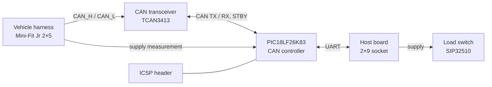
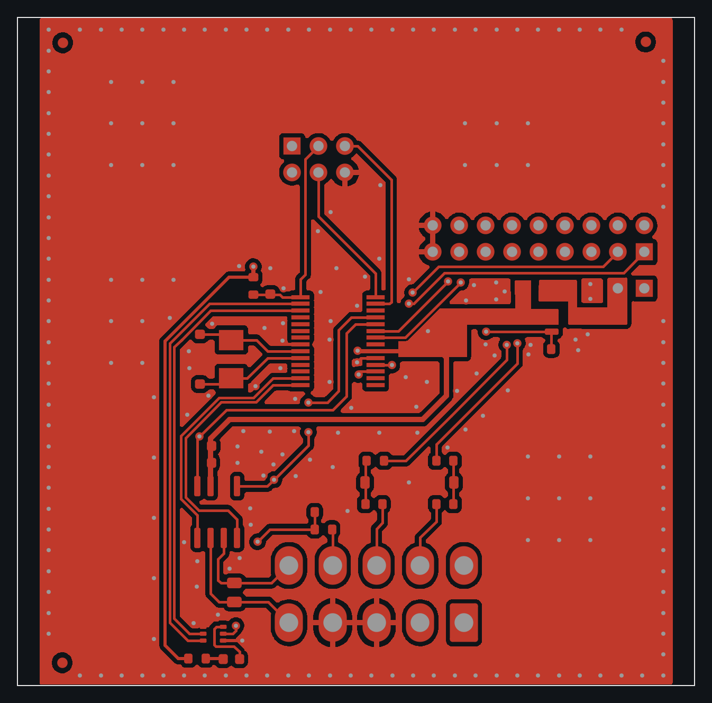
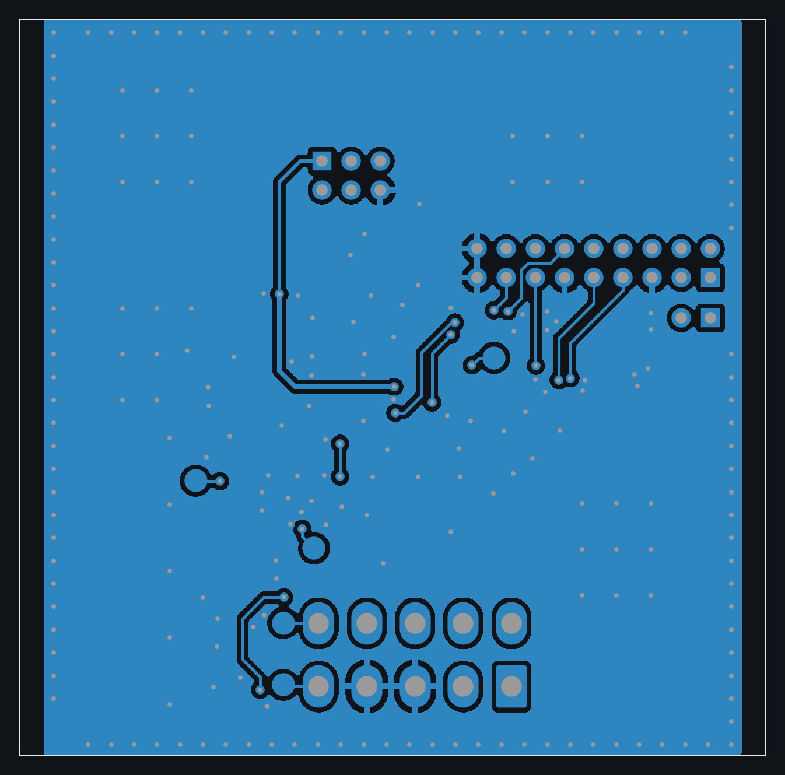

# CANLink Module

**Plug-in CAN bus interface board: a PIC18 with an integrated CAN controller and a TI CAN transceiver bridge a vehicle CAN bus to a host board over UART.**

2-layer, 65 × 64 mm board designed in KiCad.

  

## Highlights

- **PIC18LF26K83** microcontroller with an on-chip **CAN 2.0B** controller, running the CAN ↔ UART bridge
- **TI TCAN3413** CAN transceiver with standby control and a separate logic-level (VIO) supply
- Stacks onto a host board through **2×9 and 1×2 sockets** (signals and supply), with a load switch on the incoming supply
- **Molex Mini-Fit Jr** 2×5 connector to the vehicle harness, plus an analog input for measuring the vehicle / OBD2 supply
- Status LEDs and a 2×3 in-circuit programming header
- 2-layer, 65 × 64 mm, 40 components, with a solid ground pour on both sides

## System overview

## Hardware

| Block | Part |
|---|---|
| MCU | Microchip **PIC18LF26K83** (CAN 2.0B controller on chip), crystal, ICSP header |
| CAN | TI **TCAN3413** transceiver with standby and VIO |
| Power | Vishay **SIP32510** load switch |
| Connectors | Molex Mini-Fit Jr 2×5 (vehicle side), 2×9 and 1×2 sockets (host board) |
| Indicators | Status LEDs driven by **PUMH10** digital transistors |

## PCB layers

| Top copper | Bottom copper |
|---|---|
|  |  |

## My role

Schematic design, component selection and 2-layer PCB layout in KiCad.

## Schematic

- [Full schematic (PDF, 3 pages)](schematics/can_link_schematic.pdf)

---

[← Back to all projects](../README.md)
