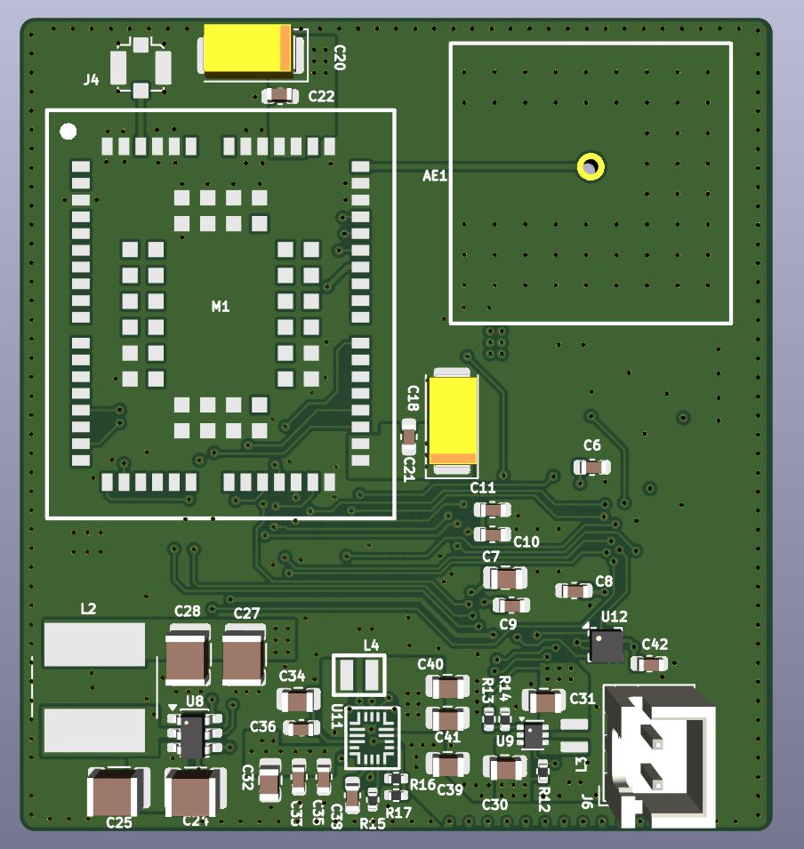
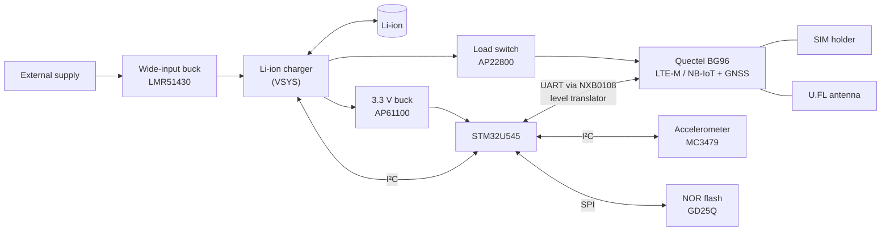

# Compact LTE-M / NB-IoT Tracker

**Small, battery-backed asset tracker on a 4-layer, 49 × 53 mm board: Quectel BG96 (LTE-M / NB-IoT with integrated GNSS), STM32U5 low-power MCU, accelerometer wake-up and Li-ion charging.**

Designed in KiCad.

  
  &nbsp;
  

## Highlights

- **Quectel BG96** LTE Cat-M1 / NB-IoT module with **integrated GNSS**, SIM holder with ESD protection, U.FL antenna connector
- **STM32U545** (Cortex-M33, ultra-low-power) with external **SPI NOR flash** for logging
- **Motion wake-up** from a 3-axis accelerometer interrupt
- **Wide-input buck** from the external supply, **Li-ion charger** with status and I²C control, separately switchable rails for the modem and the logic
- **Level translation** between the 1.8 V modem I/O and the 3.3 V MCU
- 4-layer, **49 × 53 mm**, **89 components**

## System overview

## Hardware

| Block | Part |
|---|---|
| MCU | ST **STM32U545CEU** (Cortex-M33, QFN-48), 8 MHz and 32.768 kHz crystals, SWD header |
| Cellular + GNSS | Quectel **BG96** (LTE Cat-M1 / NB-IoT, integrated GNSS), SIM holder with **DF6A6.8** ESD array, U.FL connector |
| Level shifting | Nexperia **NXB0108** 8-bit bidirectional translator (1.8 V ↔ 3.3 V) |
| Motion | MEMSIC **MC3479** 3-axis accelerometer with interrupt |
| Storage | GigaDevice **GD25Q** SPI NOR flash |
| Input supply | TI **LMR51430** wide-input synchronous buck, reverse-protection MOSFET |
| Battery | Li-ion charger with power-good / status outputs and I²C control |
| Rails | Diodes **AP61100** 3.3 V buck, Diodes **AP22800** load switch for the modem supply |

Schematic sheets: MCU, GSM/GNSS, accelerometer, battery charger, input PSU, low-voltage PSU.

## My role

Schematic design, component selection and 4-layer PCB layout in KiCad.

## Schematic

- [Full schematic (PDF, 7 pages)](schematics/compact_lte_tracker_schematic.pdf)

---

[← Back to all projects](../README.md)
