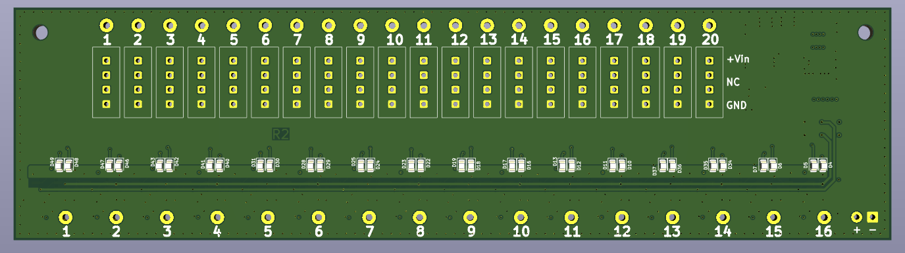
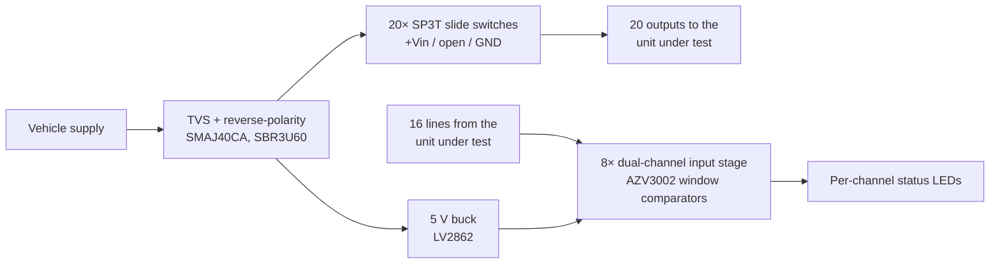
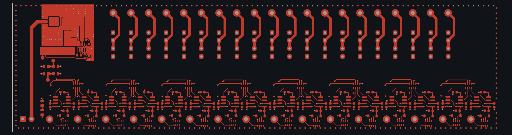
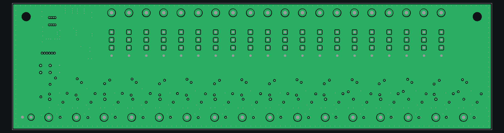
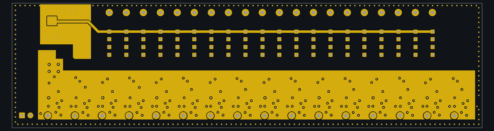
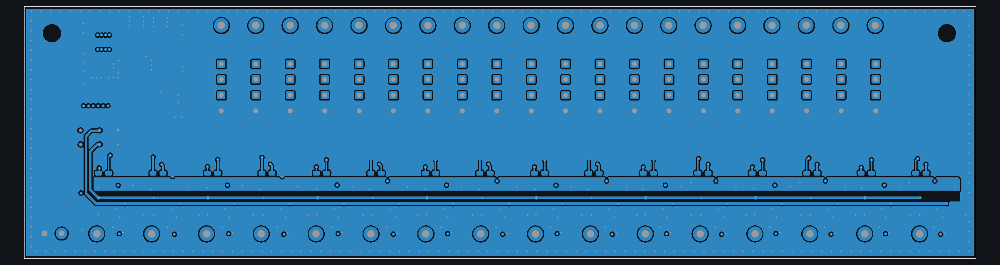

# Control Unit Tester (Rev 2)

**Stand-alone bench tester for vehicle control units: 16 input channels with window-comparator status LEDs and 20 switchable outputs. No microcontroller, no firmware, works as soon as it's powered.**

4-layer, 194 × 52 mm board designed in KiCad.

  
   
  

## Highlights

- **16 input channels** with window comparators, showing each line's state on its own LEDs
- **20 outputs**, each set by a 3-position slide switch to **+Vin, open or GND**, to stimulate the unit under test
- **Purely analog**: no MCU or firmware, so it is simple, robust and instantly usable on the bench or in the vehicle
- **Runs from the vehicle supply** through a 60 V buck with TVS and reverse-polarity protection
- 4-layer, 194 × 52 mm, **236 components**, large numbered pads for probing and wiring

## System overview

## Hardware

| Block | Part |
|---|---|
| Inputs | 8× dual-channel input sheet (16 channels): **AZV3002S** comparators with high / low reference thresholds, Zener-clamped inputs, resistor networks, status LEDs |
| Outputs | 20× **SP3T slide switches**, each routing its output to +Vin, open or GND |
| Power | TI **LV2862** 60 V step-down converter (5 V), **SMAJ40CA** TVS, **SBR3U60** Schottky reverse protection |
| Connections | 36 large through-hole pads, labelled 1–16 (inputs) and 1–20 (outputs), plus supply terminal |

The input stage is one hierarchical sheet instantiated 8 times, so all 16 channels are identical.

## PCB layers

4-layer stackup: components and routing on the outer layers, with both inner layers carrying ground and +Vin distribution to the output switches.

| Top copper | Inner 1 |
|---|---|
|  |  |
| **Inner 2** | **Bottom copper** |
|  |  |

## My role

Schematic design, component selection and 4-layer PCB layout in KiCad, for Rev 1 and the Rev 2 update.

## Schematic

- [Full schematic (PDF, 11 pages)](schematics/control_unit_tester_schematic.pdf)

---

[← Back to all projects](../README.md)
