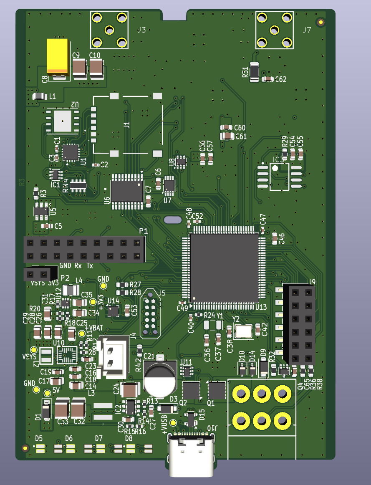
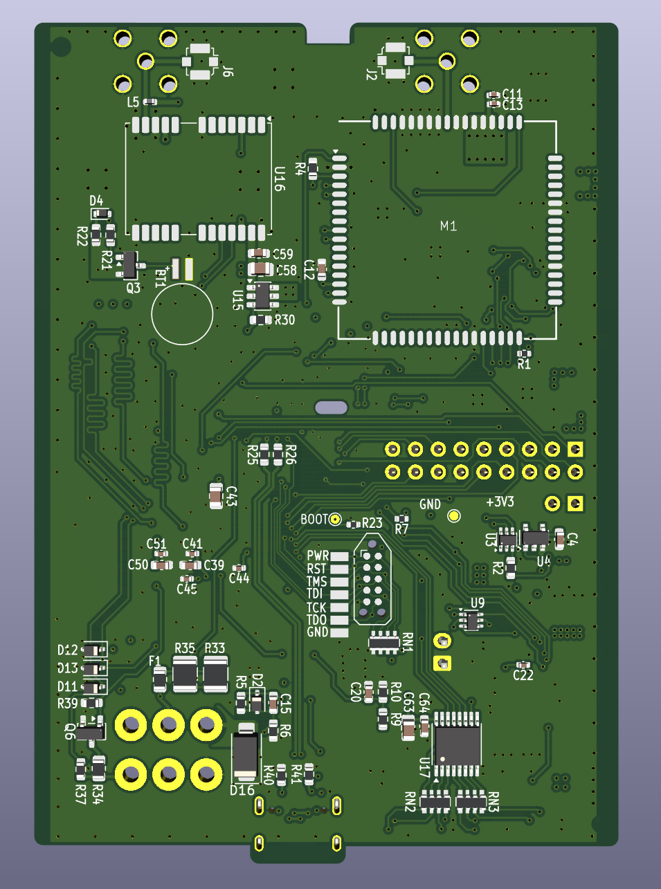
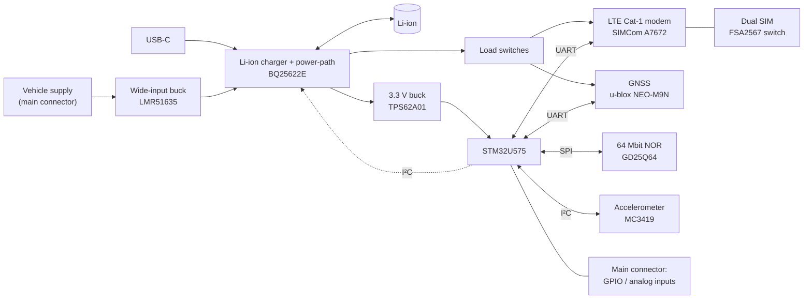
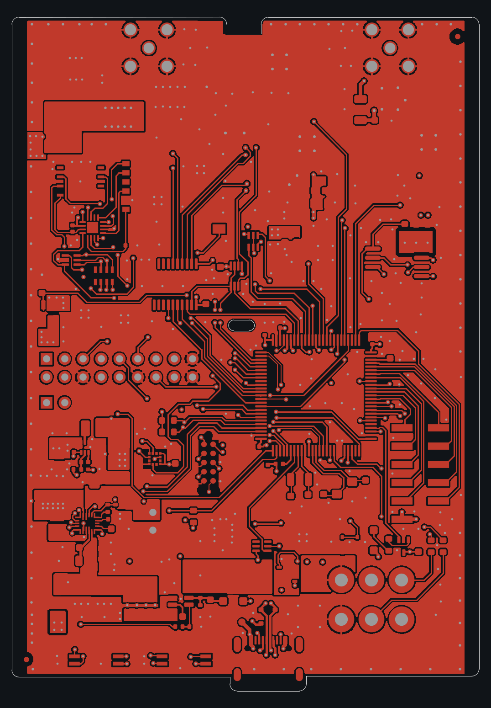
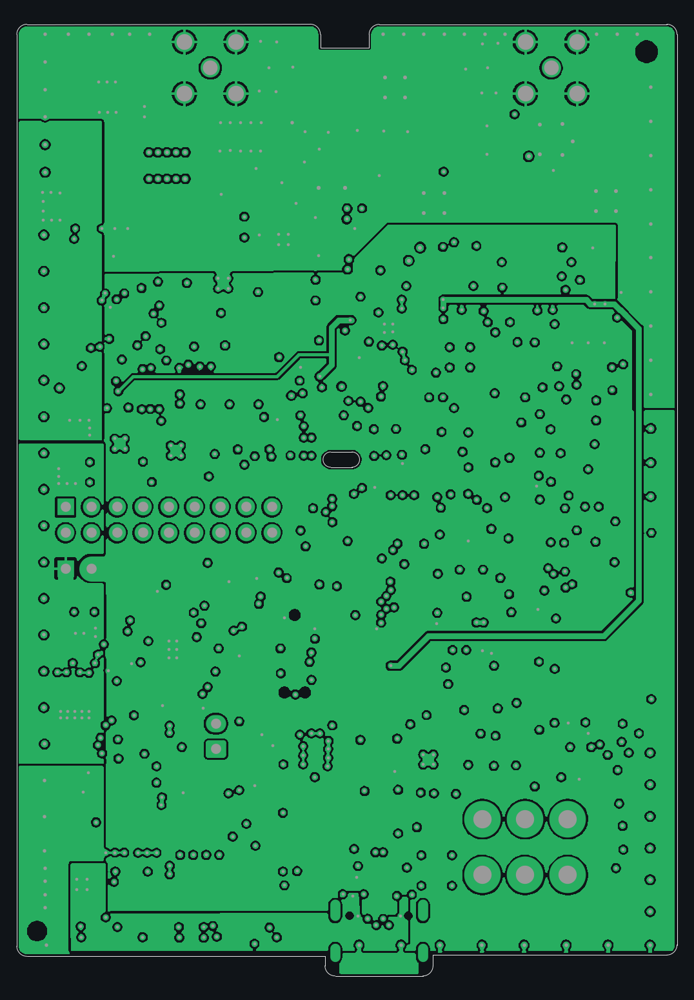
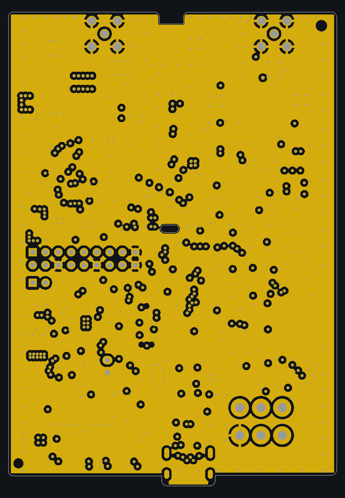
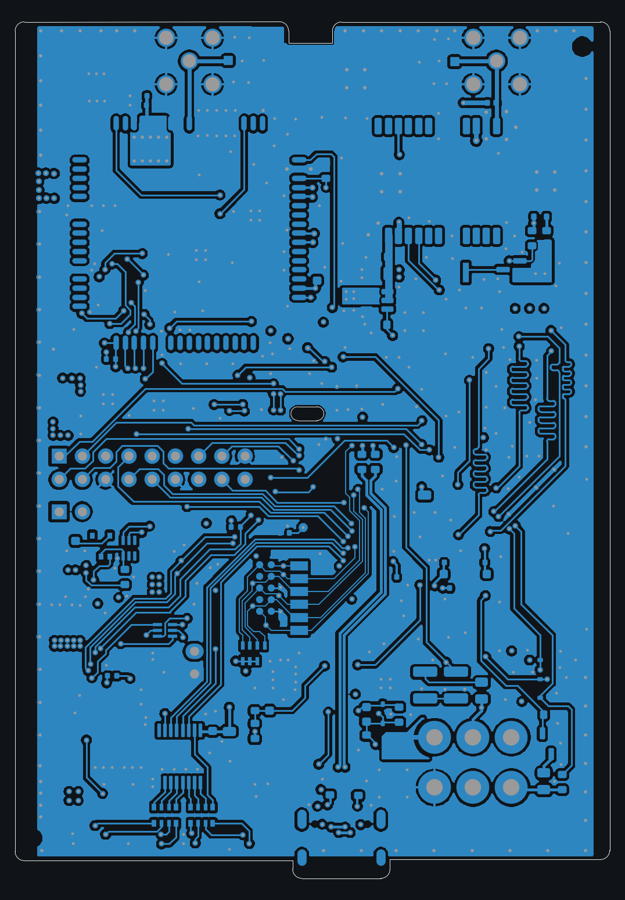

# GPS/GSM Tracker (Rev 3)

**Battery-backed LTE Cat-1 + GNSS vehicle tracker on a 4-layer, 65 × 94 mm board, built around a low-power STM32U5.**

Rev 3 of a telematics tracker, which I redesigned in KiCad for production, with Gerbers, BOM and pick-and-place.

  
  &nbsp;
  

## Highlights

- **STM32U575** (Cortex-M33, ultra-low-power) as the main controller
- **LTE Cat-1 cellular** modem with dual-SIM switching, and a **multi-constellation GNSS** receiver
- **Li-ion charger with power-path**, wide-input buck from the vehicle supply, and a rechargeable backup cell for the RTC / GNSS
- **3-axis accelerometer** for motion and event detection, **64 Mbit NOR flash** for data logging
- 4-layer, 65 × 94 mm board with **192 components**, USB-C for service and power

## System overview

## Hardware

| Block | Part |
|---|---|
| MCU | ST **STM32U575VGT6** (Cortex-M33, 100-pin), 2 crystals, SWD / JTAG header |
| Cellular | SIMCom **A7672** LTE Cat-1 module, **FSA2567** SIM switch for two SIM holders, SMA / U.FL antenna connectors |
| GNSS | u-blox **NEO-M9N**, SMA / U.FL antenna connectors |
| Motion | MEMSIC **MC3419** 3-axis accelerometer |
| Storage | GigaDevice **GD25Q64** 64 Mbit SPI NOR flash |
| Power input | TI **LMR51635** wide-input synchronous buck, TVS, polyfuse, reverse-protection MOSFETs |
| Battery | TI **BQ25622E** Li-ion charger with power-path, **MS621FE** rechargeable backup cell |
| Rails | TI **TPS62A01** 3.3 V buck, Vishay **SIP32508 / SIP32510** load switches for the modem and GNSS |
| USB | USB-C receptacle with **PRTR5V0U2X** ESD protection |
| Indicators | 4 status LEDs driven by digital transistors |

Hierarchical schematic: power supply, charger / power-path, MCU, GSM, SIM connectors, GPS, NOR flash, accelerometer, LEDs, board and main connectors, hardware reset.

## PCB layers

4-layer stackup, 1.6 mm: signals on the outer layers, split power planes on inner 1 (VSYS, 3.3 V, 5 V USB, modem supply) and a ground plane on inner 2.

| Top copper | Inner 1: power planes |
|---|---|
|  |  |
| **Inner 2: ground plane** | **Bottom copper** |
|  |  |

## My role

Rev 3 redesign in KiCad: schematic capture, component selection, 4-layer layout, and production outputs (Gerbers, BOM, pick-and-place).

## Schematic

- [Full schematic (PDF, 11 pages)](schematics/gps_gsm_tracker_schematic.pdf)

---

[← Back to all projects](../README.md)
