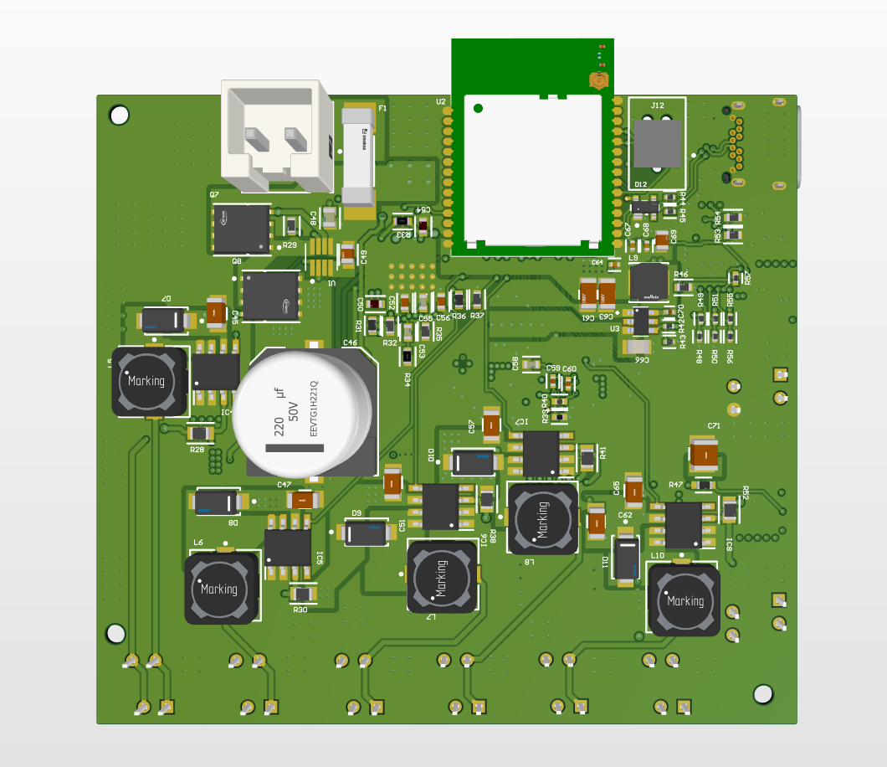
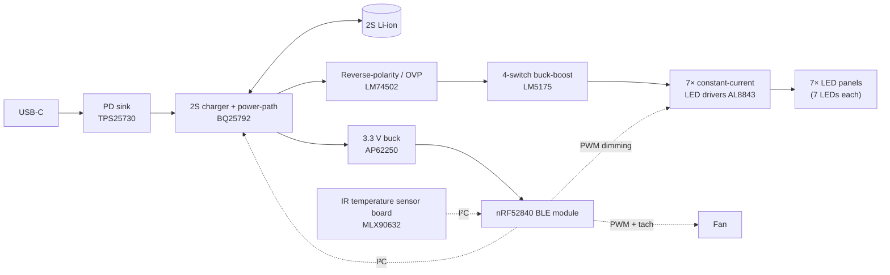
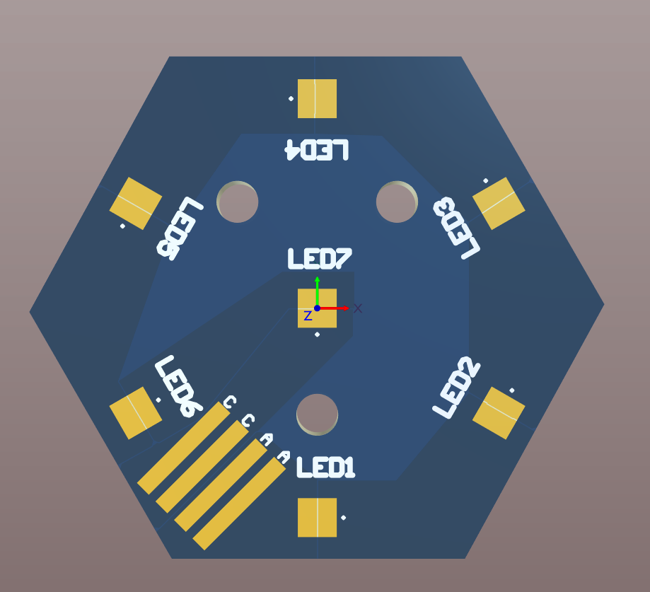
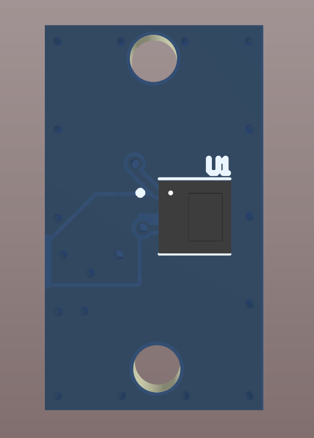
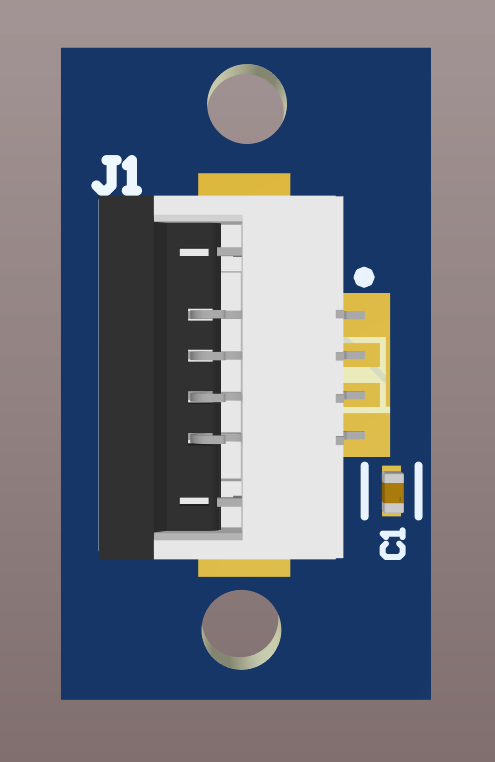

# Handheld High-Irradiance LED Controller

**Battery-powered, USB-C PD charged controller for a high-power red LED array, with Bluetooth control, per-string constant-current drive and active thermal management.**

Freelance hardware design (2026), in Altium Designer. Three boards: main controller, hexagonal LED panel, IR temperature sensor.

  
  &nbsp;
  

## Highlights

- **USB-C Power Delivery** input with a PD sink controller, charging a **2S Li-ion** pack through a buck-boost charger with power-path, so the device runs while it charges
- **4-switch buck-boost** controller generating the high-power LED rail from the battery
- **7 constant-current LED channels**, one driver per LED string to avoid current hogging, with PWM dimming
- **nRF52840** Bluetooth LE module for control, settings and logging
- **Thermal management**: non-contact IR temperature sensing plus a PWM fan with tach feedback
- **Protection**: reverse-polarity / over-voltage load disconnect, TVS, fuse

## System overview

## Main controller board

| Block | Part |
|---|---|
| USB-C input | 24-pin USB-C receptacle, **TPS25730** USB PD sink controller |
| Battery | **BQ25792**: I²C-controlled 1–4 cell buck-boost charger with power-path, 2S configuration |
| Protection | **LM74502** reverse-polarity and over-voltage controller with load disconnect, TVS, board-mount fuse |
| LED power rail | **LM5175** 4-switch synchronous buck-boost controller with external 60 V MOSFETs |
| LED drivers | 7× **AL8843** constant-current buck drivers, one per LED string, FPC outputs to the panels |
| Logic supply | **AP62250** 3.3 V buck |
| MCU / radio | Minew **MS88SF** module (Nordic **nRF52840**), Tag-Connect programming |
| Thermal | Fan output with PWM control and tach input; header for the IR sensor board |

Hierarchical schematic: USB-C, PD, charger, protection switch, LED power supply, 3.3 V buck, MCU, and one LED-driver sheet instantiated 7 times.

## LED panel

Hexagonal board carrying **7 high-power red LEDs** (OSRAM) in series, on a hexagonal lattice so that several panels tile a round illumination area. Connected to its driver channel through an FPC.

 

## IR temperature sensor

  
  

Small board with a **Melexis MLX90632** non-contact infrared temperature sensor, connected to the main board over an FPC (I²C). Used for temperature monitoring alongside the fan control.

## My role

System architecture, component selection, power-path design, schematics and PCB layout for all three boards in Altium Designer.

## Schematics

- [Main controller board (PDF)](schematics/main_board_schematic.pdf)
- [LED panel (PDF)](schematics/led_panel_schematic.pdf)
- [IR sensor board (PDF)](schematics/ir_sensor_schematic.pdf)

---

[← Back to all projects](../README.md)
