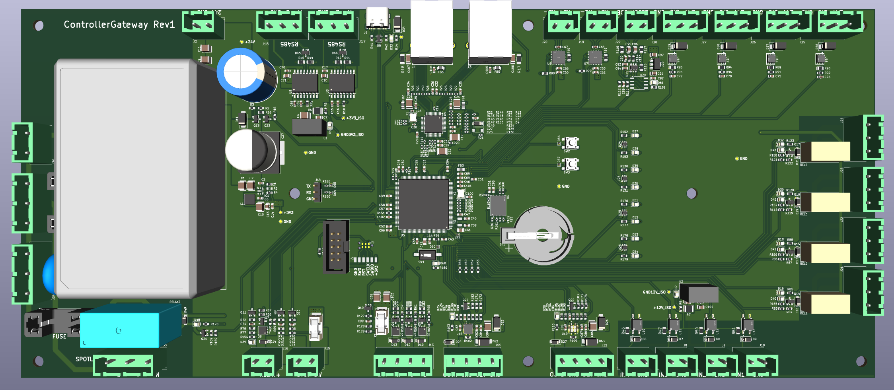
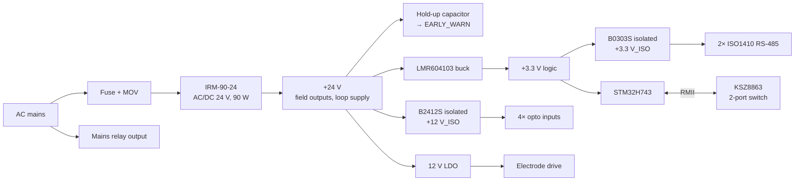
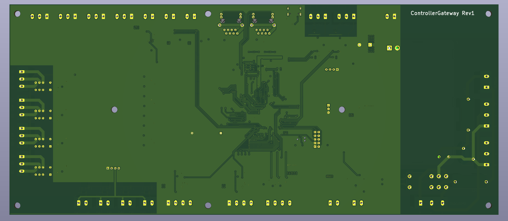

# Industrial Controller / Gateway (Rev 1)

**Mains-powered industrial controller that bridges a managed 2-port Ethernet switch to a wide set of 24 V field I/O, with isolated RS-485, 4–20 mA and PT100 inputs, relay and smart high-side outputs, and a mains-switching channel.**

Hardware design in KiCad: 4-layer, 340 × 147 mm, 486 components.

  

## Highlights

- **STM32H743** (Cortex-M7, 400 MHz, LQFP-144) with every pin assigned and every peripheral checked against the datasheet's alternate-function table
- **Microchip KSZ8863** managed 3-port Ethernet switch: two RJ45 ports plus an RMII link to the MCU, with the switch providing the 50 MHz reference clock
- **Four separate ground / isolation domains**: logic, isolated RS-485, isolated opto inputs, and mains protective earth
- **On-board AC/DC**: 90 W, 24 V supply, synchronous buck to 3.3 V, isolated 3.3 V and 12 V rails, and a hold-up capacitor with an early power-fail warning to the MCU
- **Mains, 24 V field wiring and 3.3 V logic on one board**, laid out with creepage and clearance in mind
- 4-layer, **340 × 147 mm**, **486 components**, 23 schematic sheets with reused hierarchical blocks

## Field I/O

| Function | Count | Implementation |
|---|---|---|
| Ethernet 10/100 | 2 | KSZ8863RLL managed switch, RJ45 with integrated magnetics |
| RS-485 (isolated) | 2 | TI **ISO1410** isolated transceivers, SM712 TVS, termination |
| 4–20 mA analog inputs | 4 | **MAX14626** loop protectors, 100 Ω burden, RC filtering |
| Opto-isolated digital inputs | 4 | EL357 optocouplers on an isolated 12 V wetting supply |
| Relay outputs (DPDT) | 4 | Dry contacts, with the second pole used as contact feedback |
| Smart high-side outputs | 2 | TI **TPS27S100** with current monitoring and load detection |
| Low-side outputs | 4 | MOSFET switches for RGB lighting and an inverter control line |
| Mains relay output | 1 | Double-pole switching of L and N, fused |
| PT100 RTD inputs | 2 | **MAX31865** RTD-to-digital converters (SPI) |
| Conductivity electrode | 1 | Differential square-wave drive (TLV9352) and **INA299** current sense |
| USB 2.0 device | 1 | USB-C with ESD protection |
| QSPI NOR flash | 1 | 256 Mbit W25Q256 |

## Power and isolation

| Domain | Contents | Isolated by |
|---|---|---|
| GND | Logic and 24 V return | reference |
| RS-485 ground | Bus side of both RS-485 ports | isolated DC-DC + ISO1410 barriers |
| Opto ground | Field side of the opto inputs | isolated DC-DC + optocouplers |
| Earth | Mains protective earth | mains side only |

## MCU interfaces

Ethernet RMII + MDIO, QUADSPI flash, USB OTG FS, 2× UART for RS-485 with direction control, SPI for the PT100 converters, 4 ADC channels for 4–20 mA, current-monitor ADC inputs, debug UART, SWD, and HSE / LSE crystals with a coin-cell RTC backup.

## My role

Hardware design: system architecture, component selection, schematic capture (23 hierarchical sheets), 4-layer PCB layout, and the isolation and mains-safety design, in KiCad.

## Schematic

- [Full schematic (PDF, 32 pages)](schematics/controller_gateway_schematic.pdf)

  

---

[← Back to all projects](../README.md)
