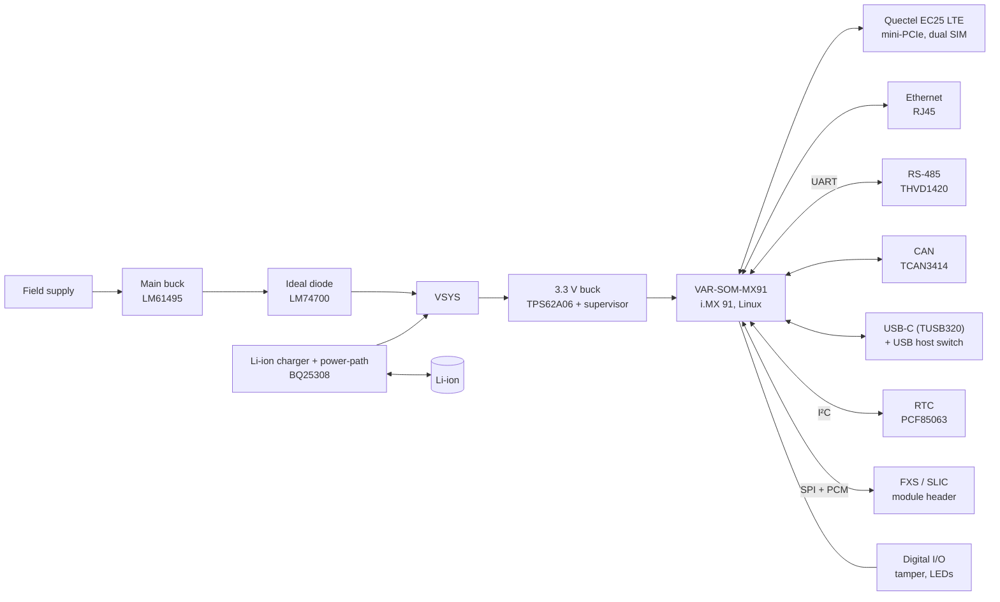

# Linux SoM Carrier Board

**Industrial IoT carrier board for an NXP i.MX 91 Linux System-on-Module, with LTE, Ethernet, RS-485, CAN, battery backup and tamper detection.**

Full design by me in KiCad: architecture, schematic, 4-layer layout and board bring-up. Rev 1 built and tested.

  

## Highlights

- Carrier for a **Variscite VAR-SOM-MX91** (NXP i.MX 91, Arm Cortex-A55, Linux)
- **LTE Cat-4** Quectel EC25 in a mini-PCIe slot, **dual SIM** with a SIM switch
- **Industrial interfaces**: 10/100 Ethernet, **RS-485** with surge protection, **CAN**, digital inputs/outputs
- **Battery-backed power**: wide-input buck from the field supply, ideal-diode OR-ing, Li-ion charger with power-path, supply and battery monitoring
- **USB-C** with CC role detection and a switched USB host port, **RTC** with backup, **tamper** switch input, **telephony (FXS)** module header
- 4-layer, **167 × 100 mm**, **274 components**

## System overview

## Hardware

| Block | Part |
|---|---|
| Compute | Variscite **VAR-SOM-MX91** (NXP i.MX 91), boot-mode DIP switch, debug UART |
| Cellular | Quectel **EC25** mini-PCIe LTE module, **FSA2567** dual-SIM switch, two SIM holders |
| Ethernet | 10/100 PHY on the SoM, **RJ45 with integrated magnetics** and link/activity LEDs |
| RS-485 | TI **THVD1420** half-duplex transceiver, **SM712** TVS, termination |
| CAN | TI **TCAN3414** transceiver with standby / shutdown control |
| USB | USB-C with **TUSB320** CC logic, **TPD4EUSB30** ESD, **AP2171W** host power switch |
| Main supply | TI **LM61495** wide-input synchronous buck, **SMAJ36A** TVS, reverse-polarity protection |
| Battery | TI **BQ25308** Li-ion charger with NTC, TI **LM74700** ideal-diode OR-ing, supply and battery voltage measurement |
| 3.3 V | TI **TPS62A06** buck with **TPS3808** voltage supervisor / reset |
| RTC | NXP **PCF85063** real-time clock with 32.768 kHz crystal and backup |
| I/O | Buffered digital inputs and transistor outputs, **TCA9539** I²C GPIO expander for status LEDs, tamper switch |

Schematic sheets: System on Module, main PSU, battery charger, 3.3 V supply, Ethernet, CAN, RS-485, USB, SIM cards, LTE, RTC, SLIC/FXS, GPIO, LEDs, anti-tampering.

## Bring-up

Rev 1 was assembled and brought up. Two minor errata were found and documented for the next revision:

- A **TX/RX pair was swapped** on one serial interface
- The **USB VBUS detection** line was left unconnected

## My role

Full design: system architecture, component selection, schematic capture, 4-layer PCB layout, and hardware bring-up and debugging of Rev 1.

## Schematic

- [Full schematic (PDF, 16 pages)](schematics/som_carrier_board_schematic.pdf)

---

[← Back to all projects](../README.md)
