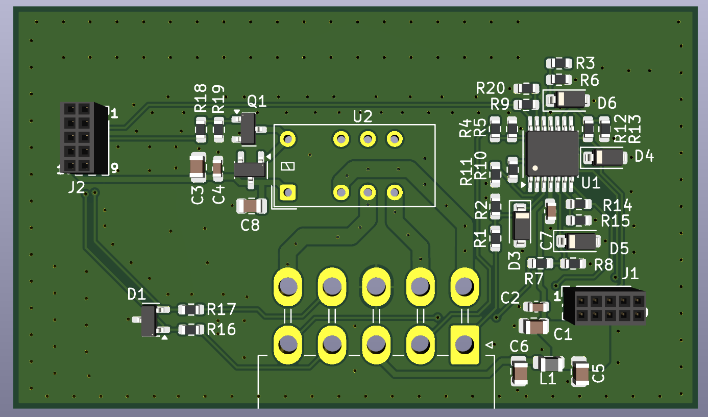
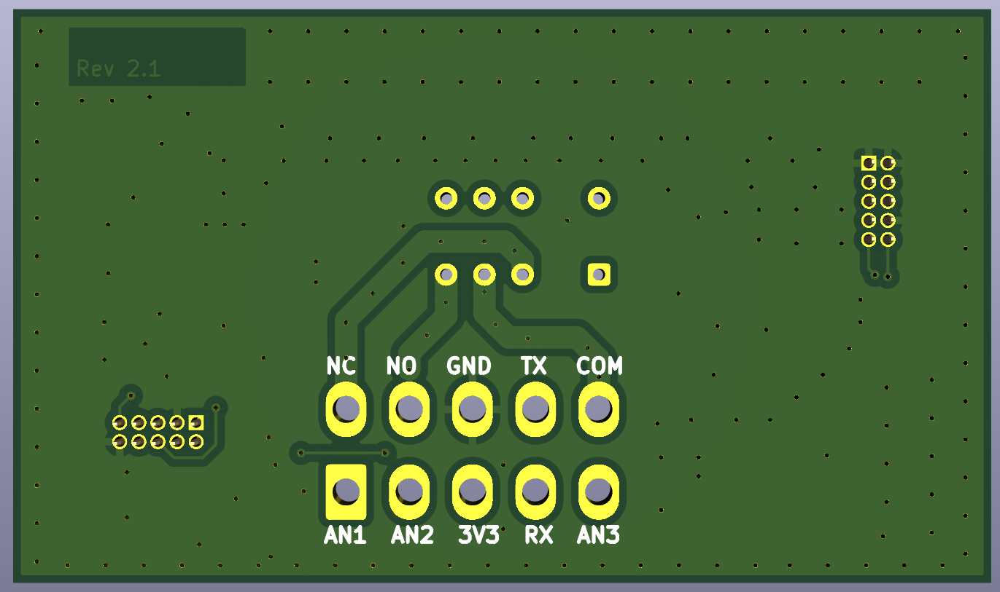
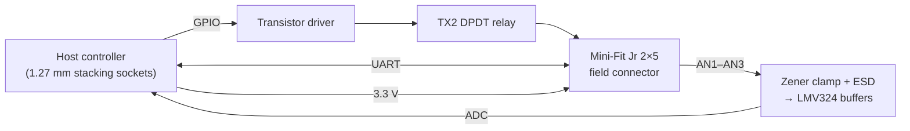
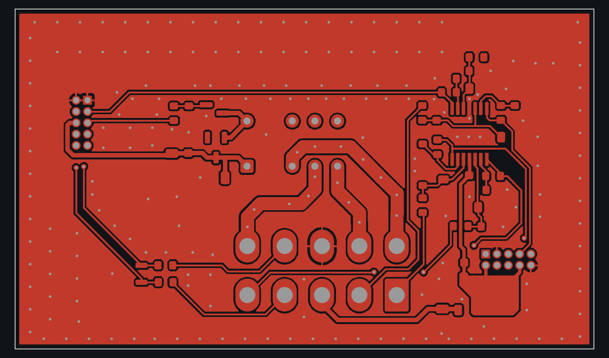
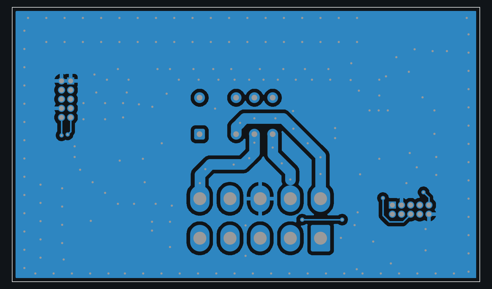

# Relay & Analog Input Expansion Board (Rev 2.1)

**Stack-on expansion board that adds a relay output, conditioned analog inputs and a UART to a host controller, all brought out on one rugged field connector.**

2-layer, 65 × 38 mm board designed in KiCad.

  
  &nbsp;
  

## Highlights

- **Relay output**: Panasonic TX2 DPDT signal relay with a transistor driver, dry contacts (COM / NO / NC) on the field connector
- **Analog inputs**: **LMV324** quad op-amp front end with Zener clamping and ESD protection on every input
- **UART** and a **3.3 V output** passed through to the field connector
- **Molex Mini-Fit Jr** 2×5 field connector, and two 1.27 mm 2×5 stacking sockets to the host board
- 2-layer, 65 × 38 mm, 41 components, with ground pours on both sides

## System overview

## Hardware

| Block | Part |
|---|---|
| Relay | Panasonic **TX2** DPDT (4.5 V coil), **MMBT2222A / MMBT6427** driver, flyback diode |
| Analog front end | TI **LMV324** quad op-amp, **MMSZ4685** Zener clamps, **ESDA5V3L** ESD arrays |
| Connectors | Molex **Mini-Fit Jr** 2×5 (field side), 2× 1.27 mm 2×5 sockets (host side) |
| Power | 3.3 V supply output to the field connector |

The schematic has four analog channels; three are brought out on the field connector, which had no free pin for the fourth.

## PCB layers

| Top copper | Bottom copper |
|---|---|
|  |  |

## My role

Schematic design, component selection and 2-layer PCB layout in KiCad, through Rev 2 and Rev 2.1.

## Schematic

- [Schematic (PDF)](schematics/relay_analog_io_schematic.pdf)

---

[← Back to all projects](../README.md)
