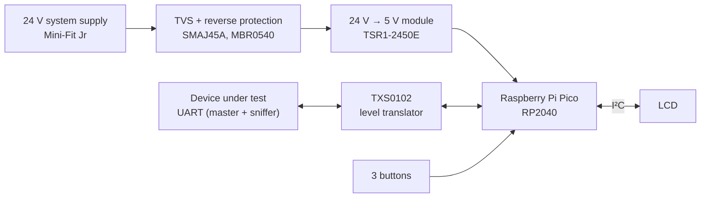
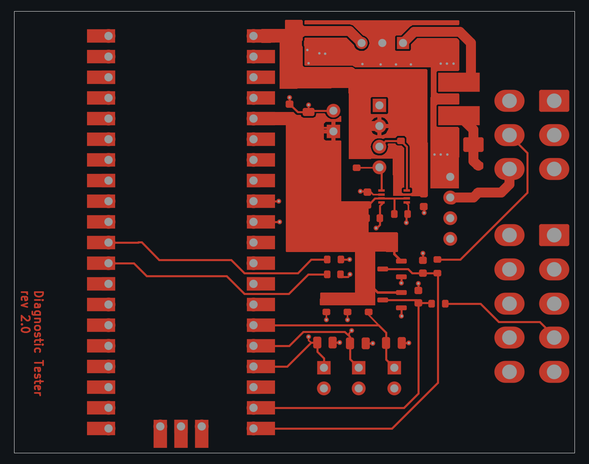
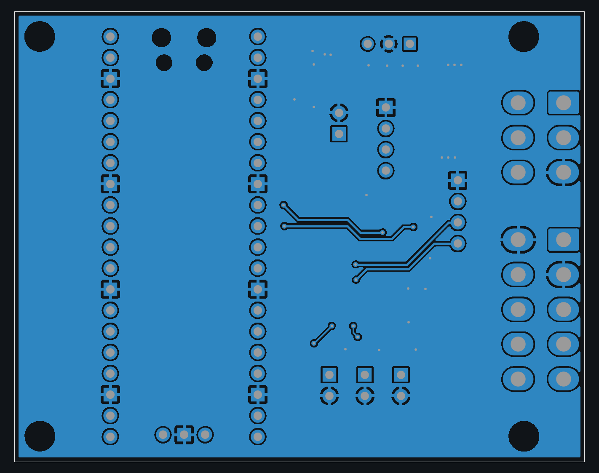

# RP2040 Diagnostic Tester (Rev 2)

**Raspberry Pi Pico–based field diagnostic tool: powered from a 24 V system, it talks to and sniffs UART links on the equipment under test, with an I²C LCD and push-buttons for stand-alone use.**

2-layer, 69 × 54 mm board designed in KiCad. Rev 1 → Rev 2.

  

## Highlights

- **Raspberry Pi Pico** (RP2040) carrier with every GPIO labelled on the silkscreen and an SWD header for debugging
- **24 V input** with TVS surge protection and reverse-polarity protection, and a **24 V → 5 V switching regulator module**
- **Two UART channels**, one to talk to the device under test and one to **sniff** an existing link, with **TXS0102** level translation and clamp diodes
- **I²C LCD connector** and **three push-buttons** for a stand-alone user interface
- **Molex Mini-Fit Jr** field connectors, with 2-pin headers for configuration jumpers
- 2-layer, 69 × 54 mm, 43 components

## System overview

## Hardware

| Block | Part |
|---|---|
| MCU | **Raspberry Pi Pico** (RP2040) module, SWD header |
| Power | Traco **TSR1-2450E** 24 V → 5 V switching regulator, **SMAJ45A** TVS, **MBR0540** Schottky reverse protection |
| Serial | TI **TXS0102** bidirectional level translator, **BAT54S** clamp diodes on the UART lines |
| User interface | 4-pin I²C LCD connector, 3 push-button inputs |
| Connectors | Molex **Mini-Fit Jr** 2×3 and 2×5 field connectors, pin headers for LCD, sniffer and jumpers |

## PCB layers

| Top copper | Bottom copper |
|---|---|
|  |  |

## My role

Schematic design, component selection and 2-layer PCB layout in KiCad, from Rev 1 to Rev 2.

## Schematic

- [Schematic (PDF)](schematics/diagnostic_tester_schematic.pdf)

---

[← Back to all projects](../README.md)
