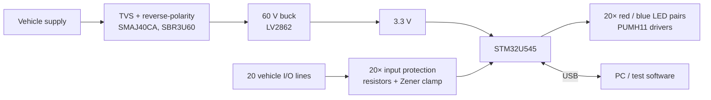

# Vehicle I/O Validator (Rev 2)

**Bench and in-vehicle test tool with 20 protected inputs and per-channel status LEDs that monitors vehicle I/O lines and reports them to a PC over USB.**

4-layer, 142 × 72 mm board designed in KiCad around an STM32U5.

  

## Highlights

- **20 input channels**, each with its own protection stage, wired straight to the MCU
- **Red / blue LED pair per channel** for an at-a-glance view of every line's state
- **STM32U545** (Cortex-M33) reading all channels and reporting them over **USB-C**
- **Runs from the vehicle supply**: 60 V buck regulator with a 40 V TVS and reverse-polarity protection, or from USB
- 4-layer, 142 × 72 mm, **232 components**, numbered test terminals along the board edge

## System overview

## Hardware

| Block | Part |
|---|---|
| MCU | ST **STM32U545VE** (Cortex-M33, 100-pin), crystal, boot button, SWD connector |
| Inputs | 20× protection stage: resistor network and 3.3 V Zener clamp (one hierarchical sheet, instantiated 20 times) |
| Indicators | 20× red / blue LED pair driven by **PUMH11** digital transistors (one sheet, instantiated 20 times) |
| Power | TI **LV2862** 60 V step-down converter, **SMAJ40CA** TVS, **SBR3U60** Schottky reverse protection |
| USB | USB-C receptacle with **PRTR5V0U2X** ESD protection |
| Expansion | 2×10 expansion header |

The schematic makes heavy use of repeated hierarchical sheets, so each channel is designed once and reused, which keeps all 20 channels identical.

## My role

Schematic design, component selection and 4-layer PCB layout in KiCad, for Rev 1 and the Rev 2 update.

## Schematic

- [Full schematic (PDF)](schematics/vehicle_io_validator_schematic.pdf). It includes one page per channel instance.

---

[← Back to all projects](../README.md)
